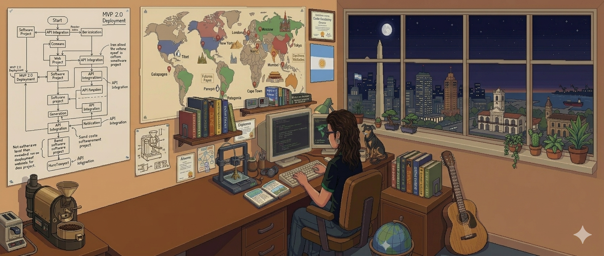

  

---

## Sobre mí · About me 🇦🇷
### Español
Hola, soy **Agustina** — desarrolladora de software 🇦🇷 con foco en **infraestructura y DevOps**. Me ocupo de entornos y servidores para facilitar despliegues, mejorar el rendimiento y mantener servicios estables. Hoy trabajo como **DevOps Engineer**, desarrollando y operando servicios con distintas tecnologías.

Me motiva seguir aprendiendo y sumar desafíos nuevos.

**Idiomas:** español (nativo) · inglés (trabajo y documentación técnica).

### English
Hi, I'm **Agustina** — a software developer from Argentina with a focus on **infrastructure and DevOps**. I work on environments and servers to streamline deployments, improve performance, and keep services reliable. I'm currently a **DevOps Engineer**, building and running services across different stacks.

I'm always keen to learn and take on new challenges.

**Languages:** Spanish (native) · English (professional / technical docs).

---

## Stack · Herramientas
Herramientas y tecnologías que uso o con las que trabajo:

_Tools and technologies I use or work with:_

               

_…y más según el proyecto · …and more depending on the project._

**Skills map (diagrama / notas):** [GitMind](https://gitmind.com/app/docs/mh3z4wpv) · [Skills site](https://agustinafassina.github.io/AgustinaFassina.Skills/)

---

## Proyectos destacados · Featured projects
Algunos repos públicos que resumen bien mi foco (infra, automatización y seguridad en la nube):

_A few public repos that capture my focus (cloud infra, automation, and security):_

- **[Aws.Fargate.Terraform](https://github.com/agustinafassina/Aws.Fargate.Terraform)** — Despliegue y escalado de apps en **ECS Fargate** con Terraform. · Automates deploy & scaling on **ECS Fargate** with Terraform.
- **[Aws.Auto.SecurityMonitor](https://github.com/agustinafassina/Aws.Auto.SecurityMonitor)** — Baseline para escanear recursos AWS con jobs en contenedores. · Scalable baseline to scan AWS resources with containerized jobs.
- **[Af.Boto3.Aws](https://github.com/agustinafassina/Af.Boto3.Aws)** — Scripts en Python (**Boto3**) para provisión, gestión y monitoreo en AWS. · Python (**Boto3**) scripts for AWS provisioning, management & monitoring.
- **[Aws.Dashboard.App](https://github.com/agustinafassina/Aws.Dashboard.App)** — Dashboard que consume una API con info de seguridad en AWS. · Dashboard that pulls security info from AWS via a REST API.
- **[TemplateApi.Net10](https://github.com/agustinafassina/TemplateApi.Net10)** — Template de API REST en **.NET 10** para arrancar proyectos. · **.NET 10** REST API template to bootstrap new services.
- **[Diagrams.With.Python](https://github.com/agustinafassina/Diagrams.With.Python)** — Diagramas generados con Python a partir de infra Terraform. · Python-generated diagrams kept in sync with Terraform infra.

Más repos (pipelines Azure↔AWS, backups EC2/Mongo/Redis, OpenAI en Azure, etc.) en el [perfil](https://github.com/agustinafassina?tab=repositories).

_More repos (Azure↔AWS pipelines, EC2/Mongo/Redis backups, Azure OpenAI, etc.) on my [profile](https://github.com/agustinafassina?tab=repositories)._

---

## Contacto · Contact
| | |
|---|---|
| **Email** | [agustinafassina@gmail.com](mailto:agustinafassina@gmail.com) |
| **LinkedIn** | [linkedin.com/in/agustina-fassina-458247163](https://www.linkedin.com/in/agustina-fassina-458247163/) |
| **Artículos · Articles** | [Medium — @agustinafassina_92108](https://medium.com/@agustinafassina_92108) |

---

## Redes · Socials

---

## Colaboración · Collaboration
**ES:** Si querés charlar sobre infraestructura, automatización u OSS, escribime por email o LinkedIn. Arriba tenés una selección de proyectos; el resto (y los **pins**) están en mi [perfil de GitHub](https://github.com/agustinafassina).

**EN:** If you'd like to talk infrastructure, automation, or OSS, reach out by email or LinkedIn. Featured projects are above; the rest (and **pins**) live on my [GitHub profile](https://github.com/agustinafassina).