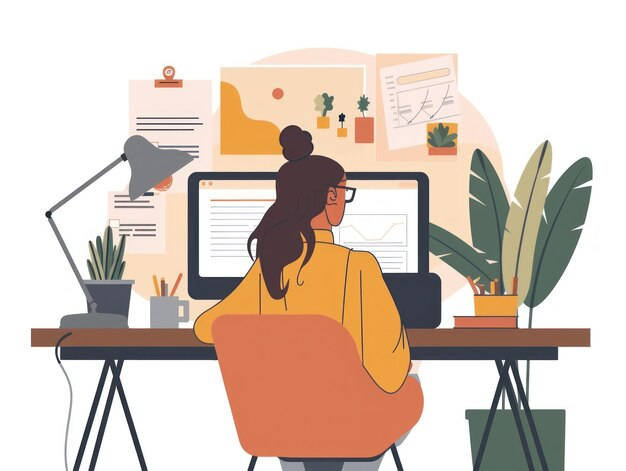

  

## 💫 About Me

👋 Hi, I'm Agustina! 
I'm a software developer 💻 🇦🇷 with experience in infrastructure and DevOps. I handle setting up and managing servers to facilitate deployments and ensure performance. Currently, I work as a DevOps Engineer, developing and maintaining services across various technologies. 
 
Always eager to learn and take on new challenges!.
 

📫 How to reach me agustinafassina@gmail.com 
✠https://www.linkedin.com/in/agustina-fassina-458247163/ 
💻 My skills https://gitmind.com/app/docs/mh3z4wpv 
📰 My articles: https://medium.com/@agustinafassina_92108

### 🌐 Socials
   
